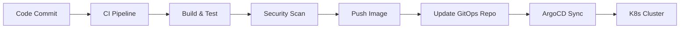

# Diagramas de Arquitectura

Este directorio contiene los diagramas de arquitectura del proyecto de modernización del pipeline.

## Diagramas Disponibles

- **Arquitectura Actual**: Flujo del pipeline actual con integración Azure DevOps
- **Arquitectura Objetivo**: Modelo GitOps con ArgoCD, IaC con Terraform y security gates
- **Flujo de Datos**: CI/CD completo con gestión de artefactos y secretos
- **Modelo de Adopción**: Fases de migración y coexistencia legacy/moderno

## Flujo GitOps Básico

## Herramientas Recomendadas

- **Mermaid**: Integrado en Markdown, ideal para versionado
- **Draw.io**: https://app.diagrams.net/ (gratuito)
- **PlantUML**: Para diagramas UML como código

## Contribución

Al agregar nuevos diagramas:
1. Crear versión editable (`.drawio` o `.mmd`)
2. Exportar a PNG/SVG de alta calidad
3. Documentar propósito en este README
4. Referenciar desde documentos principales
